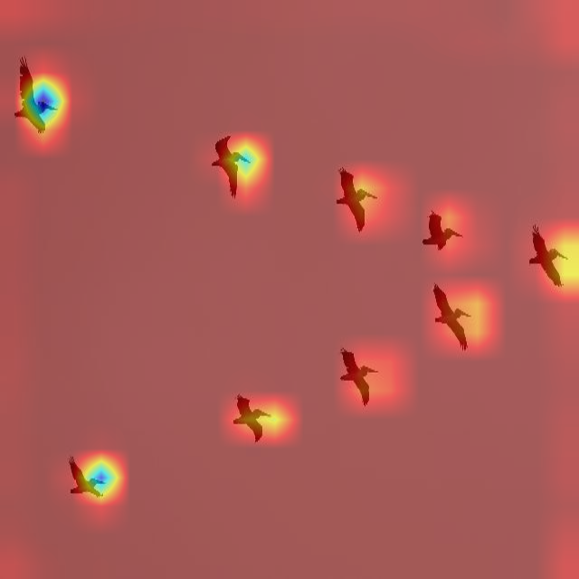

# Bird and Drone Detection & Tracking from UAV Camera

# Objective
Develop a computer vision and deep learning model capable of detecting and tracking birds and drones from an onboard camera installed on a UAV. The model should effectively differentiate between birds and drones, even when they appear as small objects in the image (low pixel count). The focus is on building an efficient, explainable, and deployable solution suitable for resource-constrained environments.

# Datasets
The following are the links to the datasets used in this project:
- [Abdulrahman Eidhah](https://universe.roboflow.com/abdulrahman-eidhah/final-jdwbv)
- [Dr. Ali Hilal, Dr. Maher Al-Baghdadi](https://www.kaggle.com/datasets/hussein1234/drone-uav-bird/data)

# Data Augmentations
The following augmentations were performed randomly of the dataset (using the roboflow platform):
- Resize to 640x640 (Fit within)
- Horizontal Flip
- Varied Saturation: +-25%
- Varied Exposure: +-10%
- Varied Brightness: +-15%
- Tiling (not used due to lack of suitable dataset)

Resultant dataset had ~11000 images

# Base Model
The model used is the Yolov8 model due to the use of SPPF (Spatial Pyramid Pooling Fusion) in its architecture. The purpose of SPPF is to provide a multi-scale representation of the input feature maps. By pooling at different scales, SPPF allows the model to capture features at various levels of abstraction. This can be particularly useful in object detection, where objects of different sizes may need to be detected.  It is an optimized version with the same mathematical functionality of SPP (Spatial Pyramid Pooling) originally used in YOLOv3, but fewer floating-point operations (FLOPs). The specific architecture used in this project is yolov8n for a balance in speed and accuracy.  

# Optimizations
Possible optimizations are as follows:
- Pruning: Tt is important to note that pruning a model might not always significantly reduce inference time. In some cases, pruning can introduce sparsity patterns that are not favorable for efficient computation, leading to slower inference times. Sparse computations can be more complex to implement and optimize compared to dense computations. This complexity arises from the need to handle irregular data structures, which can make efficient parallel processing more challenging.
- Static Quantization: Static quantization converts the weights and activates of a neural network to lower precision (e.g., from 32-bit floating-point to 8-bit integers) during the training or post-training phase. During inference, both the weights and activations are quantized to int8. 
- Model Distillation: A smaller model, often referred to as a student model, is trained to mimic the behavior of a larger, more complex model, known as a teacher model. The goal is to transfer the knowledge and performance of the larger model to the smaller one. Probability distributions produced by the teacher model for each input example is used to train student model.
- SAHI (Slicing Aided Hyper Inference): Partitioning images into manageable slices, running object detection on each slice, and then stitching the results back together. Allows for improved detection of small objects in large images while reducing computational cost.

# Gradcam Analysis

# Setup
- Install anaconda navigator
- At the bottom of the environments list, select Import.
- In the Import Environment dialog, choose to import from your Local drive.
- Select the corresponding folder icon to choose the environment you want to import (requirements.yaml).
- Enter a name for the new environment.
- Click Import.

# Resources
- Coluccia, Angelo, et al. "Drone vs. bird detection: Deep learning algorithms and results from a grand challenge." Sensors 21.8 (2021): 2824.
- Thai, Phat Van, et al. "Small Flying Object Detection and Tracking in Digital Airport Tower through Spatial-Temporal ConvNets." Available at SSRN 4740820 (2023).
- Huang, Huadong, et al. "Improved small-object detection using YOLOv8: A comparative study." Appl. Comput. Eng 41.1 (2024): 80-88.
- Shandilya, Shishir Kumar, et al. "YOLO-based segmented dataset for drone vs. bird detection for deep and machine learning algorithms." Data in Brief 50 (2023): 109355.
